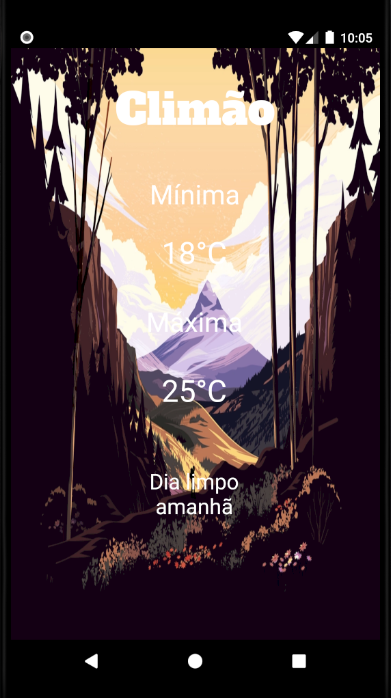

# Clima Android

<p align="center">
  
</p>

##  Descrição
O **Funny Weather** é um aplicativo android que têm como propósito trazer informações do clima de forma rápida e intuitiva, trazendo a temperatura máxima e minima em graus celsius e a condição do clima do dia seguinte.

# 🛠 Tecnologias
- Retrofit
- SugarORM

### 📝 Requisitos
- É necessario ter o SDK 8 instalado em sua maquina.
- Android Studio.
- É recomendado o uso da versão OREO 26 do android para o emulador. 
- Recomendado uso do Gradle para compilação do código.

# 🖥️ Deploy
```bash
# Clonar o repositorio
git clone https://github.com/joaozangeli/ClimaAndroid

# Entrar na pasta do repositorio
cd ClimaAndroid
```

# ☁️ API
O **HG Weather** é uma API que fornece dados de previsão do tempo e condições climáticas atuais para uma cidade.

# ❌ Erros
**Incidência 1:** none_day Caso a condição climática do dia não seja encontrada, essa condição é acessada e exibe sua mensagem de erro.

**Incidência 2:** none_night Caso a condição climática da noite não seja encontrada, essa condição é acessada e exibe sua mensagem de erro.

**Incidência 3:** default Caso nenhuma condição climática seja encontrada, essa condição é acessada e exibe sua mensagem de erro.

# 🔗 Links Importantes
- **Retrofit** - https://square.github.io/retrofit/
- **SugarORM** - https://satyan.github.io/sugar/
- **IDE Android Studio** - https://developer.android.com/studio
- **Documentação API** - https://hgbrasil.com/status/weather

# 👤 Membros
- João Egídio (back-end)
- Fabrício (front-end)
- Rafael (front-end)
- Pâmela (front-end)

# 📞 Suporte
## E-mail
ClimaWebES@gmail.com

## Telefone
(27)988063886
